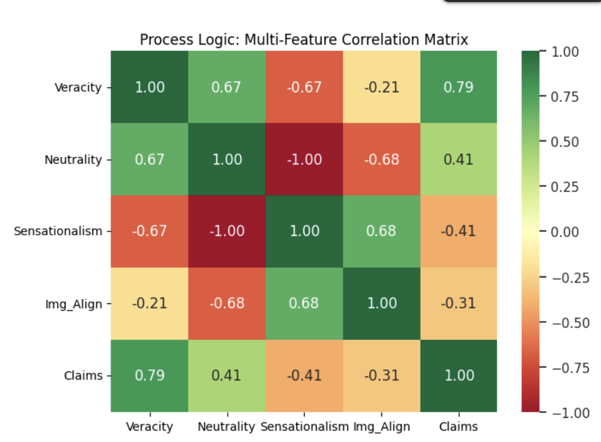
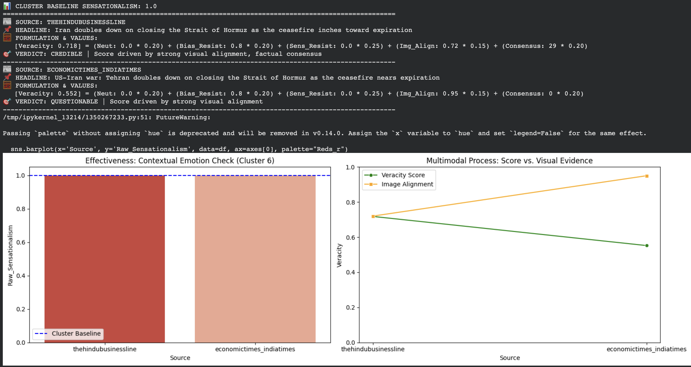
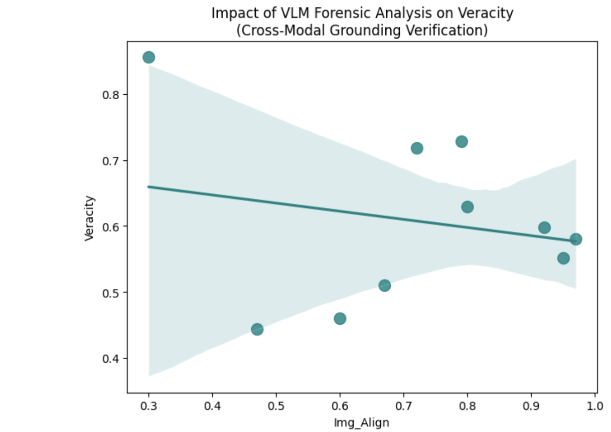

# TruthLens: A Multimodal Neuro-Symbolic Framework for News Veracity

TruthLens is an autonomous news verification engine designed to solve critical setbacks in modern AI fact-checking, such as LLM hallucinations, fixed-bias sentiment analysis, and visual misdirection. 

By combining **Large Language Models (LLMs)**, **Vision-Language Models (VLMs)**, and **Symbolic Logic**, TruthLens provides a mathematically grounded veracity score based on factual consensus and forensic visual grounding.

---

## 📂 Dataset 
This project utilizes a **Dynamic Event-Driven Dataset** strategy:
* **Live Ingestion:** Real-time fetching via NewsData.io API.
* **Clustering:** Articles are grouped using `SentenceTransformer` cosine similarity.
* **Sample Data:** A curated sample of articles used for thesis case studies is available in the `sample_data/` folder.

---

## 🏗 System Architecture
The pipeline flows from autonomous data ingestion to event-based clustering, followed by multimodal feature extraction and final weighted veracity scoring.

### 💡 Key Innovations 
* **Neuro-Symbolic Claim Extraction:** Combines LLaMA-3 claim extraction with spaCy NER verification to eliminate ungrounded "hallucinated" claims.
* **Context-Aware Normalization:** Adjusts emotional intensity scores against a dynamically calculated Cluster Baseline to prevent false penalties in crisis reporting.
* **Cross-Modal Grounding:** Utilizes Qwen2-VL to perform forensic audits between headlines and images, detecting recycled or mismatched media.
* **Transparent Scoring:** A linear weighted combination engine prioritizing factual consensus and linguistic neutrality.

---
## 📊 Results & Outputs
The TruthLens framework provides a transparent **Forensic Audit** for every news cluster.

### Multi-Feature Correlation Matrix

*This matrix validates the statistical significance of our features, confirming Factual Consensus as the primary anchor for truth.*

### Case Study Analysis: Cluster 6 (Strait of Hormuz) 

| Source | Veracity Score | Verdict | Key Reason |
| :--- | :--- | :--- | :--- |
| The Hindu Business Line | 0.718 | **Credible** | 29 Verified Consensus Matches |
| Economic Times | 0.552 | **Questionable** | 0 Consensus Matches (Outlier) |

### Forensic Performance & Contextual Baselines 

*Left: Context-Aware Baseline in action. Right: Image Alignment vs. Veracity comparison.*

---

## 📄 License 
This project is licensed under the **MIT License** - see the `LICENSE` file for details.
